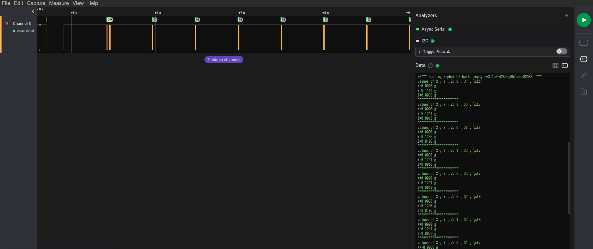

# Arduino Library demo

## Overview
********

This Arduino library shown here for demo purposes is the Seeed Studio's [ADXL345](https://github.com/Seeed-Studio/Accelerometer_ADXL345).
Data from an ADXL345 sensor connected over `i2c0` on the arduino nano 33 ble is .

If you place to use any other Arduino Library, it is best to copy-paste the ``.h`` and ``.cpp`` files directly into the ``src`` folder of this repo. Then, you just have to make one change to the CMakeLists of this repo that is to add the cpp file of the Arduino Library (and replace ``ADXL345.cpp``).

If you run into any build errors related to Serial or Wire or anything else, then raise an issue on the [ArduinoCore Zephyr upstream repo](https://github.com/zephyrproject-rtos/gsoc-2022-arduino-core). It maybe possible that a few variants of ``Serial.print`` or else ``Wire`` maybe missing.

## Requirements

Your board must:

1. Have atleast 1 i2c port.
2. Have the ADXL345 sensor connected to the I2C port.

## Building and Running

Build and flash as follows,

```sh

$> west build -p -b arduino_nano_33_ble .

$> west flash --bossac=/home/$USER/.arduino15/packages/arduino/tools/bossac/1.9.1-arduino2/bossac

```

After flashing, probe the UART pin (TX) / console output and you should be able to see X, Y and Z values printed on console if everything goes well.

## output:


